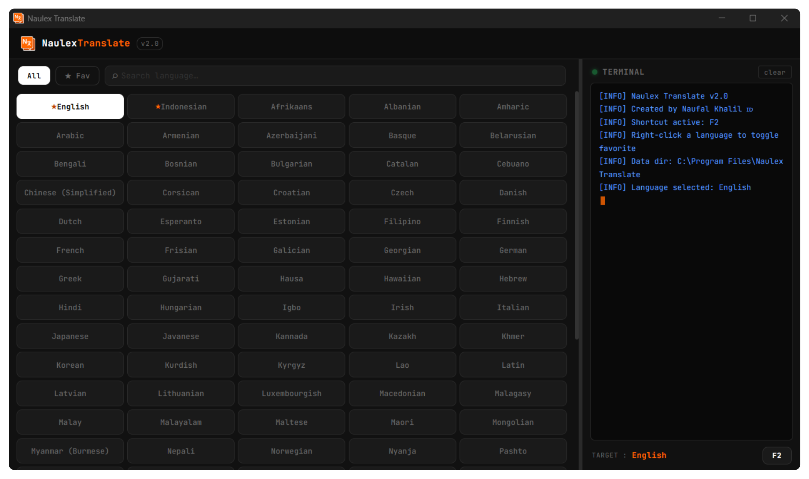
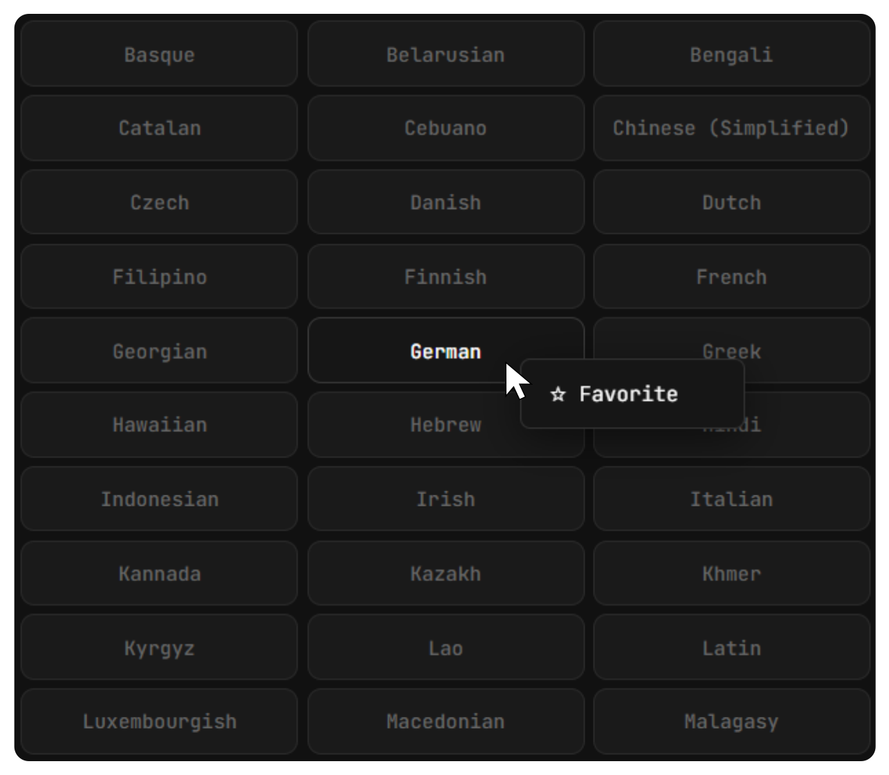

<table>
  <tr>
    <td>
      
    </td>
    <td>
      <h2>Naulex Translate v2.0</h2>
      

        A modern desktop translator with fast performance, dark UI, and interactive features.
      

    </td>
  </tr>
</table>

---

## 🛡️ Badges

---

##  Naulex Translate v2.0

**Naulex Translate** is a modern desktop translator with a clean dark UI, fast performance, and interactive features. Designed for daily use such as learning languages, gaming, chatting, and productivity.

---

## 🚀 Current Version

🔥 **v2.0**

Major improvements:

* Modern & responsive UI
* Favorite language system
* Interactive terminal log
* Faster workflow & shortcuts

---

## 🌍 Supported Languages

Supports **100+ international languages** 🌐

Examples:
English, Indonesian, Japanese, Korean, Chinese, Arabic, German, French, Spanish, Russian, Hindi, and more.

---

## ⚙️ Built With

* Python (Desktop App)
* Custom Dark UI
* Event-driven system
* Translation engine (API / local)

---

## ✨ Features

* Multi-language support
* Fast & responsive UI
* Smart language selector
* Search language
* Favorite system ⭐
* Terminal log panel
* Shortcut support (F2)
* Modern dark UI

---

## 🖼️ App Preview

---

## ⚙️ How to Use

Follow these steps to start using **Naulex Translate**:

1. **Launch the Application**
   Open *Naulex Translate* by running the `.exe` file.

2. **Select Target Language**
   Choose the language you want to translate into from the available language list.

3. **Choose a Language**

   * **Left Click** on a language → to select it as your active target language
   * The selected language will be applied instantly

4. **Start Typing Anywhere**
   Open any application or game (e.g. chat, browser, or notes), then:

   * Type any text normally
   * Naulex Translate will process your input based on the selected language

5. **Use Shortcut (F2)**
   Press `F2` to quickly trigger or interact with translation features (depending on your setup)

6. **Monitor Terminal Panel**
   Check the built-in terminal/log panel to see:

   * Translation activity
   * System responses
   * Debug or process information

---

## ⭐ Favorite Language Feature

Manage your frequently used languages easily:

- **Add to Favorite**  
  Right click on any language → it will be added to your favorites ⭐  

- **Quick Access**  
  Favorite languages are prioritized for faster selection  

- **Efficient Workflow**  
  No need to search repeatedly — your most-used languages stay ready  

---

<h2 align="left">⬇️ Download</h2>

  

---

## 📩 Contact

If you have any questions, just DM me on Instagram :

👉 https://www.instagram.com/khalil.naufal_/

---

## 👨‍💻 Developer

Created by: **Naufal Khalil ID**

---

## 📄 License

This project is licensed under the MIT License — free to use, modify, and distribute.

See the [LICENSE](./LICENSE) file for details.

---

## ⭐ Support

* ⭐ Star repo
* 🍴 Fork
* 💬 Feedback

